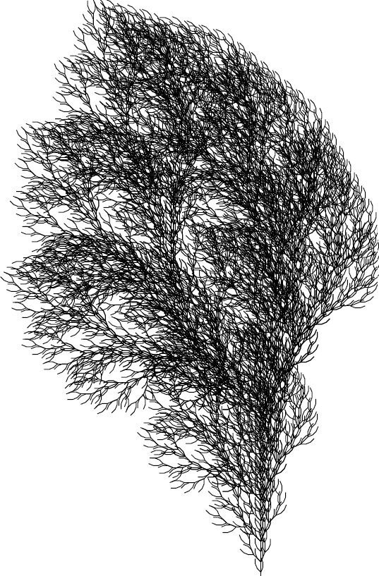
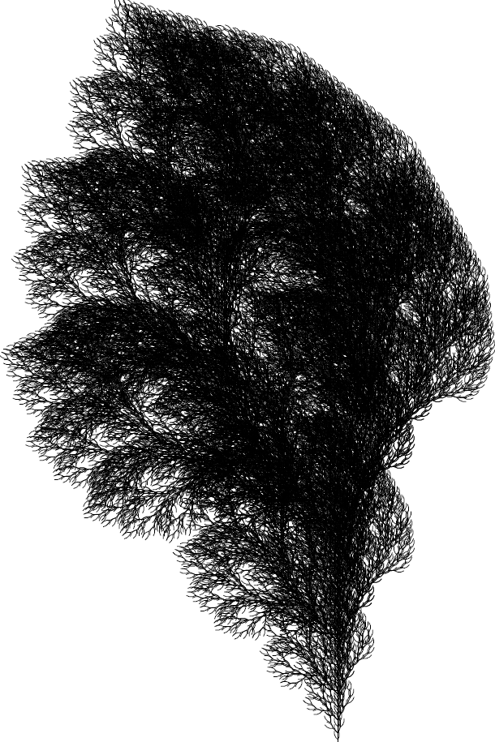

# Comment dessiner un arbre (Projet L-système)

## Aperçu

<div align="center">
    
    <p>Schéma buisson après 5 itérations</p>
</div>

<br/> 

<div align="center">
    
    <p>Schéma buisson après 6 itérations</p>
</div>

## Description

Ce projet implémente un générateur de dessins de structures arborescentes à l'aide d'un **L-système** (Lindenmayer system) et d'une **tortue graphique** (Turtle Graphics). Il s'agit de développer une application Java capable :

1. D'interpréter un fichier JSON décrivant un L-système (axiome, règles de réécriture, actions de la tortue, paramètres graphiques).
2. De réécrire le L-système sur un nombre d'itérations donné, avec prise en charge de règles aléatoires pour un même symbole.
3. De dessiner (ou calculer un bounding box) le résultat en sortie standard, au format **EPS** (Encapsulated PostScript).

L'objectif principal est de produire, par la ligne de commande, un fichier `.eps` contenant le dessin de l'arbre généré, prêt à être converti en PDF ou affiché dans un visualiseur PostScript.

## Prérequis

Pour rouler le projet, il est nécesssaire d'avoir sur sa machine :

- Une installation complète du **JDK** (version 17 ou ultérieure) pour compiler et exécuter les fichiers sources Java.
- La présence de **make** pour automatiser la compilation et l’assemblage du projet : GNU Make sous Linux/macOS ou MinGW Make sous Windows.
- La bibliothèque **JSON** incluse dans le projet, située dans le répertoire `lib/`, sous la forme d’un fichier `json-YYYYMMDD.jar`, nécessaire pour analyser les fichiers de description des L-systèmes.
- Un système capable d’exécuter la commande **jar** (fournie avec le JDK) pour créer l’archive exécutable du programme.
- Un terminal permettant d’utiliser les commandes du Makefile, dont la création du JAR, l’exécution du programme et les opérations de nettoyage.


## Fonctionnalités

* **Interprétation JSON** : Lecture d'un fichier JSON spécifiant l'axiome (chaîne initiale), les règles de réécriture (éventuellement multiples par symbole), les actions associées à chaque caractère (draw, move, turnL, turnR, push, pop) et les paramètres de la tortue (pas, angle et position de départ).
* **Réécriture récursive du L-système** : Méthode `tell(Turtle t, Iterator<Symbol> seq, int n)` permettant d'effectuer `n` itérations de réécriture sans construire explicitement la chaîne complète en mémoire (exploration paresseuse).
* **Tortue abstraite** : Interface `Turtle` fournissant les opérations essentielles (`draw()`, `move()`, `turnL()`, `turnR()`, `push()`, `pop()`, `stay()`), ainsi que la gestion du pas et de l'angle unitaire. Une implémentation “dummy” (`DummyTurtle`) sert uniquement à calculer le bounding box sans dessiner.
* **Génération EPS** : Implémentation d'une classe `PostScriptTurtle` qui traduit les opérations de la tortue en instructions PostScript (moveto, lineto, stroke, gsave, grestore). Le fichier EPS produit contient l'en-tête conforme à EPSF et le trailer avec le bounding box.
* **Règles aléatoires** : Si plusieurs règles s'appliquent à un même symbole (même côté gauche), une règle est choisie uniformément au hasard pour chaque occurrence du symbole.
* **Utilisation en ligne de commande** : Le JAR exécutable `lindenmayer.jar` prend en arguments :

    1. Le chemin vers le fichier JSON décrivant le L-système.
    2. Le nombre d'itérations de réécriture.

Exemple :

```
java -jar lindenmayer.jar test/buisson.json 5 > test/buisson5.eps
```

## Structure du projet

Le projet est organisé en packages et classes Java :

```
src/
 └── lindenmayer/
     ├── Symbol.java                   # Encapsulation d'un caractère du L-système
     ├── Turtle.java                   # Interface définissant les opérations de la tortue
     ├── AbstractLSystem.java          # Classe abstraite fournissant un squelette de L-système (choix aléatoire des règles)
     ├── LSystem.java                  # Implémentation concrète du L-système (gestion des axiomes, des règles, des itérations et du tell)
     ├── DummyTurtle.java              # Implémentation de Turtle qui ne dessine pas, sert à calculer le bounding box
     ├── PostScriptTurtle.java         # Implémentation de Turtle en générant du code PostScript/EPS
     └── Main.java                     # Classe principale (lecture JSON, initialisation, appel à tell et sortie EPS)
```

Les dépendances externes minimale sont :

* Java 8 (ou supérieur)
* Bibliothèque **JSON-java** (org.json) pour parser le fichier JSON

## Fichier JSON de spécification

Le L-système est décrit dans un fichier JSON respectant la syntaxe suivante :

```json
{
  "actions": { 
    "F": "draw",   
    "f": "move",   
    "[": "push",   
    "]": "pop",    
    "+": "turnL",  
    "-": "turnR"   
  },
  "rules": { 
    "F": ["F[+F]F[-F]F", "F[+F]F", "FF-F"],  
    "f": ["ff"] 
  },
  "axiom": "F",     
  "parameters": {
    "step": 2.0,           
    "angle": 22.5,         
    "start": [0.0, 0.0, 90.0]
  }
}
```

* **actions** : Association entre caractère (symbole) et nom de l'action à appeler sur la tortue.
* **rules** : Pour chaque symbole-clé, un tableau de chaînes représentant les possible expansions aléatoires.
* **axiom** : Chaîne initiale du L-système.
* **parameters** : Objet contenant :

    * `step` (double) : longueur du pas pour `draw()` et `move()`.
    * `angle` (double) : angle unitaire (en degrés) pour `turnL()` et `turnR()`.
    * `start` : tableau `[x, y, theta]` (doubles) définissant la position (x,y) et l’angle initial de la tortue.

### Exemple de fichier JSON

```json
{
  "actions": {"F":"draw","[":"push", "]":"pop","+":"turnL","-":"turnR"},
  "rules": {"F" : ["F[+F]F[-F]F","F[+F]F","F[+F]F[-F]F"]},
  "axiom": "F",
  "parameters" : {"step": 2, "angle":22.5, "start":[0,0,90]}
}
```

## Compilation et Exécution

1. **Cloner le dépôt**

   ```bash
   git clone https://github.com/Josh012006/Projet1-IFT2015.git
   cd Projet1-IFT2015
   ```

2. **Commandes disponibles**

   ```bash
    # Compile les sources Java et génère l'archive JAR exécutable
    make all
   
    # Compile uniquement les fichiers source Java
    make classes
   
    # Génère l'archive exécutable JAR
    make jar
   
    # Exécute le programme avec des arguments et redirige la sortie standard dans le fichier eps
    make run ARGS="test/buisson.json 5 > test/buisson5.eps"
   
    # Supprime les fichiers compilés et l'archive JAR
    make clean
   ```
   
## Visualiser le PDF

Pour voir l'image sortie par le fichier .eps généré, il faut installer GhostScript et exécuter la commande :

```bash
eps2pdf test/mon_fichier.eps
```

## Structure du dépôt GitHub

```text
├── src/                       # Code source Java
│   └── lindenmayer/
│       ├── Symbol.java
│       ├── Turtle.java
│       ├── AbstractLSystem.java
│       ├── LSystem.java
│       ├── DummyTurtle.java
│       ├── PostScriptTurtle.java
│       └── Main.java
├── lib/                       # Bibliothèques externes
│   └── json-20250517.jar
├── test/                      # Exemples de fichiers JSON de L-systèmes
│   └── buisson.json
├── out/                       # Pour la compilation Java
├── .gitignore
├── lindenmayer.jar            # JAR exécutable (généré)
├── README.md                  # Ce fichier
└── MakeFile                   # Le fichier de make pour compiler et exécuter le code plus facilement
```

## Auteurs

- **Josué Mongan**

GitHub : [Josh012006](https://github.com/Josh012006)

- **David Stanescu**

GitHub : [DavidStanescu13](https://github.com/DavidStanescu13)
